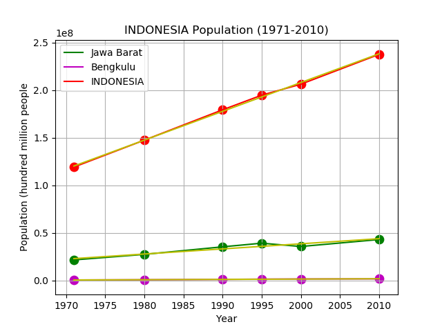

# Indonesia Population Forecasting using  Linear Regression Method from *Sci-kit Learn*
### Linear Regression
Linear regression is a basic and commonly used type of predictive analysis.  The overall idea of regression is to examine two things: (1) does a set of predictor variables do a good job in predicting an outcome (dependent) variable?  (2) Which variables in particular are significant predictors of the outcome variable, and in what way do they–indicated by the magnitude and sign of the beta estimates–impact the outcome variable?  These regression estimates are used to explain the relationship between one dependent variable and one or more independent variables.  The simplest form of the regression equation with one dependent and one independent variable is defined by the formula y = m*x + c, where y = estimated dependent variable score, c = constant, m = regression coefficient, and x = score on the independent variable.

This repo will try to predict Indonesia population by 2050: for the city with the most population in 2010, the city with the least population in 1971, and for Indonesia country as a whole. The data used in this repo is obtained from *bps.go.id* ([downloadable data](https://www.bps.go.id/statictable/2009/02/20/1267/penduduk-indonesia-menurut-provinsi-1971-1980-1990-1995-2000-dan-2010.html))
1. Download the population data from the link above. Name the excel file *population.xls*

2. Clone this repo and *run* the program. 

3. A screenshot of how the output graphic will look like:
    

4. And in your terminal it will show the predicted population numbers:
    ```
    Prediction of Jawa Barat population in 2050: 65443585
    Prediction of Bengkulu population in 2050: 3139135
    Prediction of INDONESIA population in 2050: 359273669
    ```

### **_Enjoy!_**

#

#### Albertus Rianto Wibisono ✉ _albertusrian95@gmail.com_

[Instagram](https://www.instagram.com/rian__wibisono) | 
[LinkedIn](https://www.linkedin.com/in/albertusrian95/) |
[GitHub](https://www.github.com/RiantoWibisono)
